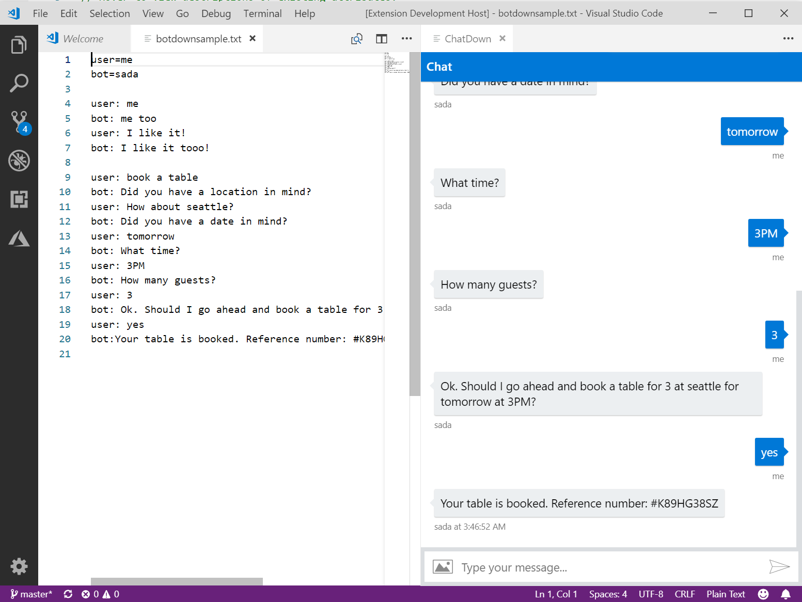

# VS Code ChatDown
Visual Studio Code Extension for ChatDown

## Features

Basic ChatDown syntax accepted.

Open a chatdown file or create a new text file, run "ChatDown" and a new VS window will open with the chat preview.

The chat is refreshed everytime a new line is added or deleted.

> Tip: Check the chatdown page here: https://github.com/Microsoft/botbuilder-tools/tree/master/packages/Chatdown

## Requirements

Visual Studio Code!

## Known Issues

Only basic syntax supported now. No fancy adaptive cards yet.

## Release Notes

### 1.0.0

Initial release
